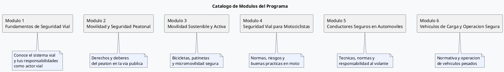
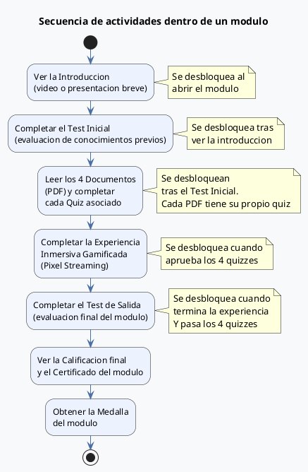

# Manual de Usuario — Plataforma de Formacion en Seguridad Vial ANSV

**Version:** 1.0  
**Fecha:** Marzo 2026  
**Audiencia:** Participantes del programa y personal administrativo de la ANSV / IU Digital

---

## Indice

1. [Que es esta plataforma](#1-que-es-esta-plataforma)
2. [Requisitos para acceder](#2-requisitos-para-acceder)
3. [Como registrarse](#3-como-registrarse)
4. [Como ingresar y cerrar sesion](#4-como-ingresar-y-cerrar-sesion)
5. [Pantalla principal — Mis modulos](#5-pantalla-principal--mis-modulos)
6. [Como completar un modulo](#6-como-completar-un-modulo)
7. [Diagnostico de perfil de riesgo vial](#7-diagnostico-de-perfil-de-riesgo-vial)
8. [La experiencia inmersiva gamificada](#8-la-experiencia-inmersiva-gamificada)
9. [Asistente virtual NIA](#9-asistente-virtual-nia)
10. [Mi perfil](#10-mi-perfil)
11. [Panel administrativo](#11-panel-administrativo)
12. [Preguntas frecuentes](#12-preguntas-frecuentes)
13. [Soporte tecnico](#13-soporte-tecnico)

---

## 1. Que es esta plataforma

La **Plataforma de Formacion en Seguridad Vial** es un programa educativo en linea desarrollado por la Agencia Nacional de Seguridad Vial (ANSV) en alianza con IU Digital. Su objetivo es fortalecer los conocimientos, habitos y actitudes de los ciudadanos colombianos frente a la movilidad segura y responsable.

El programa esta compuesto por **seis modulos tematicos** que cubren desde los fundamentos del sistema vial hasta la operacion segura de vehículos de carga. Cada modulo combina materiales de lectura, evaluaciones, una experiencia interactiva gamificada y la orientacion de una asistente virtual de aprendizaje llamada **NIA**.

Al finalizar cada modulo, el participante obtiene una **medalla digital** que certifica su avance dentro del programa.

---

## 2. Requisitos para acceder

Para utilizar la plataforma unicamente necesita:

- Un dispositivo con acceso a internet (computador, tablet o telefono inteligente).
- Un navegador web actualizado (Google Chrome, Microsoft Edge, Safari o Firefox en su version mas reciente).
- Una direccion de correo electronico valida.
- Su numero de cedula de ciudadania colombiana.
- Una conexion estable a internet (se recomienda minimo 5 Mbps para la experiencia gamificada).

No es necesario instalar ninguna aplicacion adicional en su dispositivo.

---

## 3. Como registrarse

El registro en la plataforma es gratuito y toma menos de tres minutos.

### Paso 1. Verificacion de identidad

Al ingresar a la plataforma por primera vez, seleccione la opcion **"Crear cuenta"**. Se le pedira:

- **Correo electronico:** Ingrese una direccion de correo valida a la que tenga acceso. Este sera su identificador en la plataforma.
- **Numero de cedula:** Ingrese su numero de identificacion sin puntos ni espacios.

La plataforma verifica que el formato de ambos datos sea correcto antes de continuar.

### Paso 2. Datos de perfil y contrasena

En el segundo paso complete su informacion personal:

| Campo | Descripcion |
|---|---|
| Nombre completo | Tal como aparece en su documento de identidad |
| Tipo de documento | Cedula de ciudadania, tarjeta de identidad, pasaporte, etc. |
| Departamento y municipio | Lugar de residencia actual |
| Telefono de contacto | Numero de telefono movil o fijo |
| Rango de edad | Seleccione el grupo que corresponde a su edad |
| Genero | Campo opcional |
| Enfoque diferencial | Si aplica: persona con discapacidad, comunidad etnica, etc. |
| Contrasena | Minimo 8 caracteres. Use una combinacion de letras y numeros |

Una vez completado el formulario, haga clic en **"Registrarme"**. Sera redirigido automaticamente a la pagina de inicio de sesion.

---

## 4. Como ingresar y cerrar sesion

### Inicio de sesion

1. Ingrese a la plataforma y haga clic en **"Ingresar"**.
2. Escriba su correo electronico y contrasena.
3. Haga clic en **"Entrar"**.

La sesion se mantiene activa durante **2 horas**. Pasado ese tiempo, la plataforma le solicitara que ingrese nuevamente para proteger la seguridad de su cuenta.

### Recuperacion de contrasena

Si olvido su contrasena, seleccione **"Olvide mi contrasena"** en la pantalla de inicio de sesion. Ingrese su correo electronico y numero de cedula para verificar su identidad, luego defina una nueva contrasena.

### Cerrar sesion

En el menu lateral o en la barra de navegacion inferior, seleccione el icono de **"Cerrar sesion"**. Su sesion se cierra de forma segura y sus datos quedan guardados.

---

## 5. Pantalla principal — Mis modulos

Al ingresar a la plataforma vera el catalogo de los seis modulos del programa:

Cada tarjeta muestra:
- El titulo y subtitulo del modulo.
- Una barra de progreso que refleja su avance.
- Un indicador de medalla (ganada o pendiente).

Puede navegar entre modulos libremente. **No existe un orden obligatorio** para comenzar; sin embargo, cada actividad dentro de un modulo tiene una secuencia logica que debe respetarse (ver seccion siguiente).

---

## 6. Como completar un modulo

Cada modulo esta estructurado en la siguiente secuencia de actividades:

### Detalle de cada actividad

#### Introduccion
Al ingresar a un modulo, lo primero que vera es un video breve o una presentacion que contextualiza los temas que va a estudiar. Revise este material antes de continuar.

#### Test Inicial
Una evaluacion corta de conocimientos previos. El objetivo no es aprobar o reprobar; sirve como punto de partida para medir su aprendizaje al compararlo con el Test de Salida. **No afecta su calificacion final.**

#### Documentos y Quizzes
Cada modulo incluye cuatro documentos PDF con material academico. Tras leer cada documento, debera responder un **quiz de verificacion** de lectura. Si no aprueba un quiz, puede intentarlo nuevamente desde la vista del modulo.

Los documentos estan disponibles para descarga y consulta posterior.

#### Experiencia Inmersiva
Una vez completados los cuatro quizzes, se habilitara el boton para ingresar a la **Experiencia Gamificada**. Esta es una simulacion interactiva en 3D, en tiempo real, donde representara a su actor vial en escenarios de movilidad. Al completar la experiencia recibirá una **medalla digital**.

Para una buena experiencia se recomienda:
- Usar un computador de escritorio o portatil (no telefono movil).
- Contar con una conexion estable de al menos 5 Mbps.
- Usar auriculares para una experiencia de audio completa.

#### Test de Salida
La evaluacion final que mide lo aprendido durante el modulo. Se desbloquea unicamente cuando ha completado todos los quizzes y la experiencia gamificada.

#### Certificado
Al finalizar el Test de Salida podra acceder a la calificacion del modulo y al certificado de completion. Este queda disponible permanentemente en su perfil.

---

## 7. Diagnostico de perfil de riesgo vial

Antes de iniciar los modulos, la plataforma le invitara a completar un **Diagnostico de Perfil de Riesgo Vial**. Se trata de un cuestionario breve (aproximadamente 5 minutos) que evualua su nivel de exposicion al riesgo en la via segun:

- Su rango de edad.
- Su rol como actor vial (peaton, ciclista, motociclista, conductor, etc.).
- La frecuencia y horarios de sus desplazamientos.
- Sus años de experiencia en la via.
- El uso de elementos de proteccion personal.

Con base en sus respuestas, la plataforma asignara un **Perfil de Riesgo**:

| Perfil | Descripcion |
|---|---|
| **BAJO** | Su perfil de exposicion al riesgo es reducido. El programa le ayudara a consolidar habitos preventivos. |
| **MEDIO** | Presenta factores de riesgo moderados. El programa le proporciona herramientas para reducirlos. |
| **ALTO** | Su perfil muestra factores de riesgo significativos. Los modulos priorizaran estrategias de autoproteccion. |

Este diagnostico es **confidencial**, no tiene un resultado correcto o incorrecto, y no impacta el acceso a ningun modulo del programa. Su unico proposito es personalizar las recomendaciones que recibe.

---

## 8. La experiencia inmersiva gamificada

La **experiencia gamificada** es uno de los componentes centrales del programa. Se trata de una simulacion interactiva en 3D, desarrollada sobre tecnologia de transmision de video en tiempo real (Pixel Streaming), en la que el participante:

1. Representa un avatar que refleja su tipo de actor vial.
2. Navega por escenarios viales virtuales basados en entornos colombianos reales.
3. Toma decisiones de movilidad y enfrenta situaciones de riesgo simuladas.
4. Recibe retroalimentacion inmediata sobre sus decisiones.
5. **Gana una medalla** al completar satisfactoriamente cada escenario.

### Como ingresar
Desde la vista de un modulo, haga clic en el boton **"Iniciar Experiencia"** (visible solo cuando ha completado los cuatro quizzes). La experiencia se abre dentro del mismo navegador; no es necesario instalar software adicional.

### Su avatar
En la configuracion de su perfil puede seleccionar y personalizar su avatar antes de ingresar a la experiencia. El avatar que haya configurado sera el que aparezca en la simulacion.

### Medallas
Cada modulo tiene asociada una medalla que se desbloquea al completar su experiencia gamificada. El progreso de sus medallas es visible en la pantalla principal y en su perfil. Las **6 medallas del programa** representan el dominio completo del contenido.

---

## 9. Asistente virtual NIA

**NIA** (Nuestra Inteligencia para el Aprendizaje) es la asistente virtual de aprendizaje del programa. Esta disponible en la seccion **"Chat NIA"** del menu de navegacion.

NIA puede ayudarle con:

- Resolver dudas sobre el contenido de los modulos.
- Explicar conceptos de normativa vial colombiana.
- Orientarle sobre señales de transito, documentos obligatorios y sanciones.
- Aclararle cuando y como realizar los tests y las evaluaciones.
- Guiarle si tiene problemas tecnicos para acceder a la plataforma.

### Como usar el chat
1. Haga clic en **"Chat NIA"** en el menu de navegacion.
2. Escriba su pregunta en el campo de texto inferior.
3. Haga clic en el boton de envio o presione Enter.
4. NIA respondera en pocos segundos.

El historial de su conversacion se guarda localmente en su dispositivo. Al borrar los datos del navegador, el historial se eliminara.

### Alcance de NIA
NIA esta diseñada para acompañar su aprendizaje dentro del programa. **No reemplaza la asesoria juridica ni legal especializada.** Para tramites oficiales de transito debe acudir a los canales de la ANSV o al organismo de transito correspondiente de su municipio.

---

## 10. Mi perfil

Puede acceder a su perfil haciendo clic en el icono de **"Mi Perfil"** en el menu de navegacion. Desde esta seccion puede:

### Ver su informacion personal
- Nombre completo, correo electronico y numero de cedula.
- Municipio, departamento y datos demograficos registrados al momento del registro.
- Su perfil de riesgo vial (resultado del diagnostico).

### Actualizar sus datos
Puede modificar los siguientes datos en cualquier momento:
- Nombre completo.
- Telefono de contacto.
- Avatar del programa.

### Ver su progreso general
- Avance por cada uno de los seis modulos.
- Estado de sus medallas gamificadas.
- Resumen de tests completados.

---

## 11. Panel administrativo

El panel administrativo esta disponible exclusivamente para usuarios con rol de **Administrador** (personal ANSV / IU Digital). Se accede desde el icono **"Datos"** en el menu de navegacion o directamente desde `/admin`.

### Que muestra el panel

#### Resumen de impacto
Cifras consolidadas del programa:
- Total de participantes registrados.
- Participantes que han completado al menos un modulo.
- Total de participantes con la experiencia gamificada completada.

#### Participacion por modulo
Un slider interactivo que muestra, modulo a modulo, el numero y porcentaje de participantes que han completado cada etapa del programa.

#### Mapa geografico
Distribucion de participantes por departamento y municipio, visualizada sobre el mapa de Colombia. Permite identificar las regiones con mayor y menor participacion.

#### Tabla de participantes
Listado detallado de todos los participantes con:
- Nombre y correo electronico.
- Municipio y departamento.
- Estado de cada modulo y experiencia gamificada.
- Perfil de riesgo vial.

La tabla soporta busqueda y filtrado. Desde esta vista tambien puede **exportar** el listado completo de participantes.

### Exportacion de datos
Haga clic en el boton **"Exportar"** para descargar el listado completo de participantes con todos sus datos de progreso en formato de hoja de calculo.

---

## 12. Preguntas frecuentes

**¿Puedo tomar los modulos en cualquier orden?**  
Si. Puede ingresar a cualquier modulo en el orden que prefiera. Dentro de cada modulo, sin embargo, las actividades tienen una secuencia obligatoria (introduccion → test inicial → documentos/quizzes → experiencia → test de salida).

**¿Cuánto tiempo tengo para completar el programa?**  
El programa no tiene fecha de vencimiento. Puede avanzar a su propio ritmo. Su progreso se guarda automaticamente cada vez que completa una actividad.

**¿Qué pasa si cierro el navegador a mitad de un test?**  
Las respuestas que ya haya enviado quedan guardadas. Si un test no fue completado totalmente, podra retomarlo desde donde quedo al volver a ingresar.

**¿Puedo repetir un modulo que ya complete?**  
Si. Puede volver a leer los documentos y revisar el material cuantas veces quiera. Los tests, una vez marcados como completados, no se reinician automaticamente.

**¿La experiencia gamificada funciona en mi telefono?**  
La experiencia esta optimizada para computadores de escritorio o portatiles. En dispositivos moviles puede funcionar de forma limitada dependiendo del modelo y la velocidad de conexion. Se recomienda usar un computador para esta actividad.

**¿Mi informacion personal es segura?**  
Si. La plataforma almacena sus datos protegidos con cifrado de contrasenas y conexiones seguras. Sus datos personales son tratados conforme a la Politica de Tratamiento de Datos Personales de la ANSV / IU Digital, disponible en la seccion **Legal** de la plataforma.

**¿Puedo cambiar mi correo electronico o numero de cedula?**  
No. El correo electronico y el numero de cedula son identificadores permanentes de su cuenta y no pueden modificarse una vez creada la cuenta. Si necesita corregirlos, contacte al equipo de soporte.

**¿Que debo hacer si no puedo ingresar a mi cuenta?**  
Primero intente la opcion "Olvide mi contrasena" para restablecer su clave. Si el problema persiste, contacte al equipo de soporte tecnico (ver seccion siguiente).

---

## 13. Soporte tecnico

Para problemas tecnicos con la plataforma, puede contactar al equipo de soporte por cualquiera de los siguientes canales:

| Canal | Detalle |
|---|---|
| Correo electronico | admin@urbanik-hub.com |
| Soporte dentro del chat | Preguntele a NIA en el chat: "Tengo problemas para ingresar" |

Al contactar al soporte, por favor incluya:
- Su nombre completo y correo electronico registrado.
- Descripcion detallada del problema.
- El navigador y dispositivo que esta usando.
- Capturas de pantalla del error, si las tiene disponibles.

El equipo de soporte atendera su solicitud en un plazo maximo de 48 horas habiles.

---

*Este manual corresponde a la version 1.0 de la plataforma. Para consultar la Politica de Privacidad y los Terminos de Uso, ingrese a la seccion **Legal** disponible desde la pantalla de inicio de sesion.*
