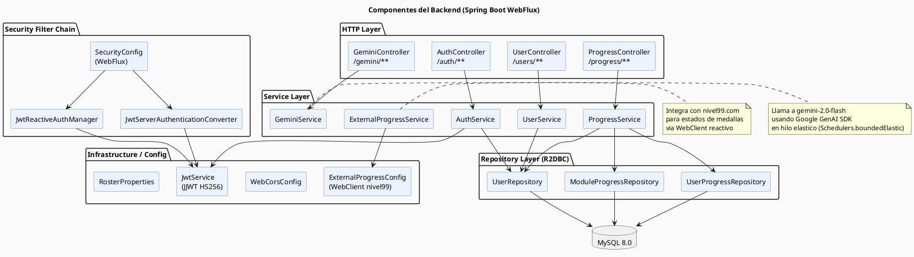
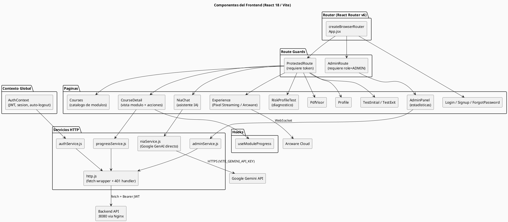
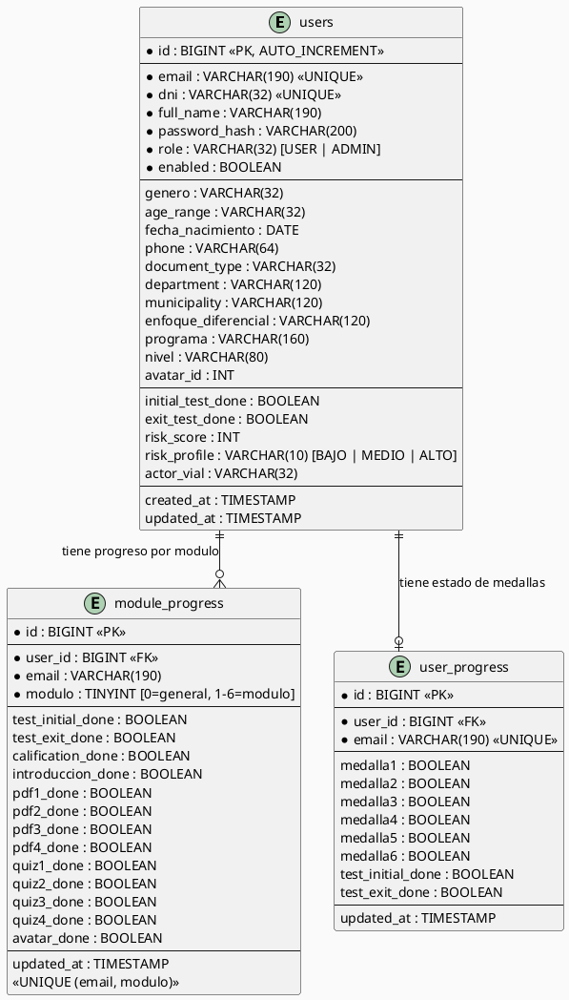
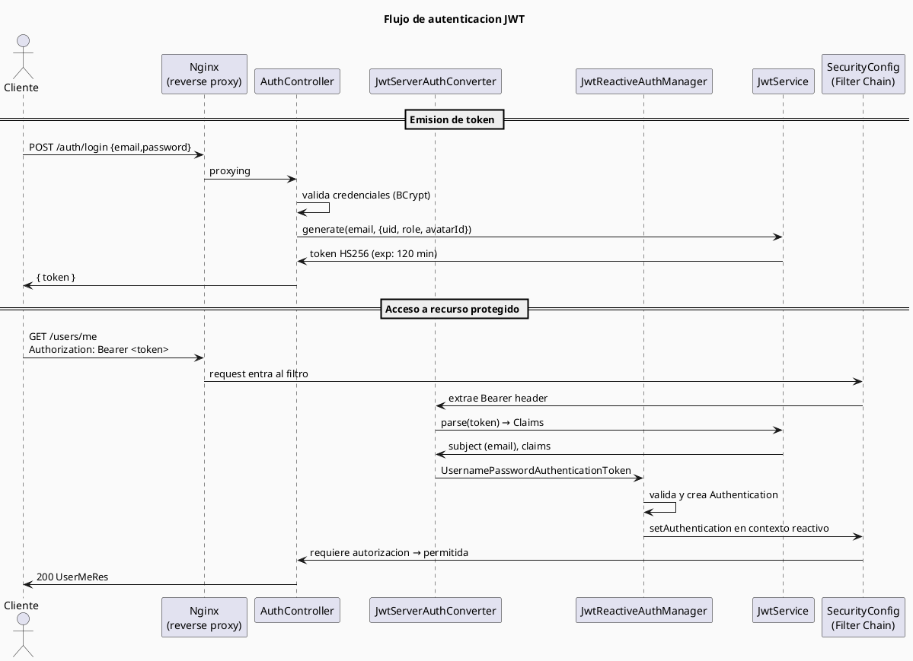
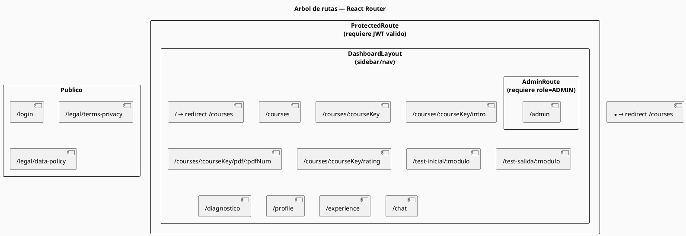
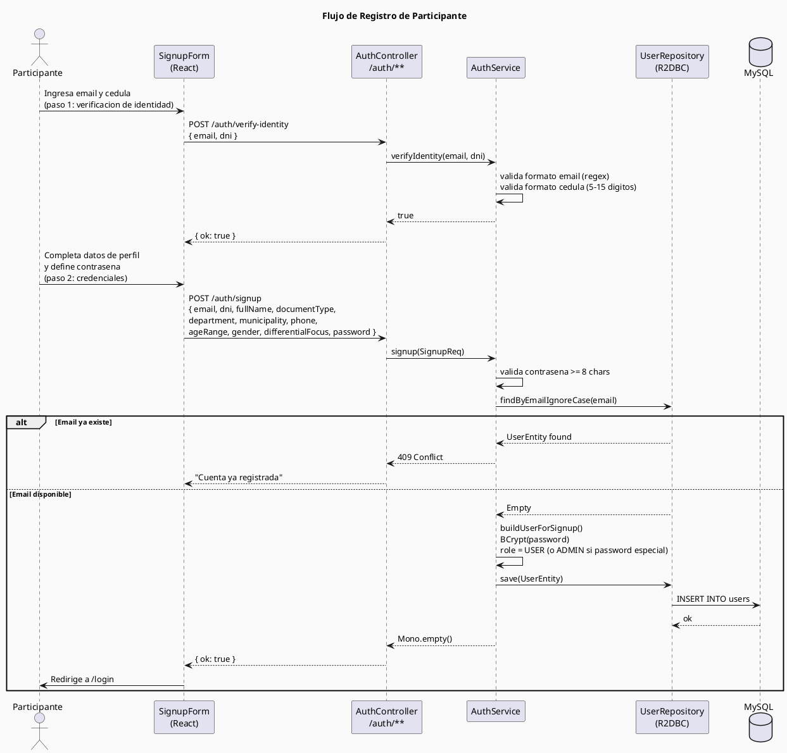
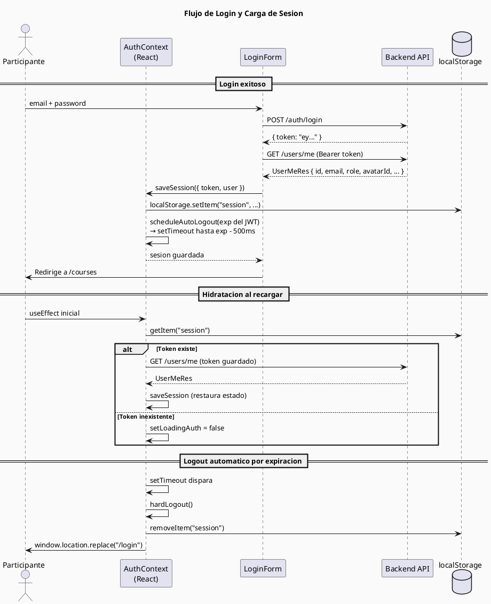
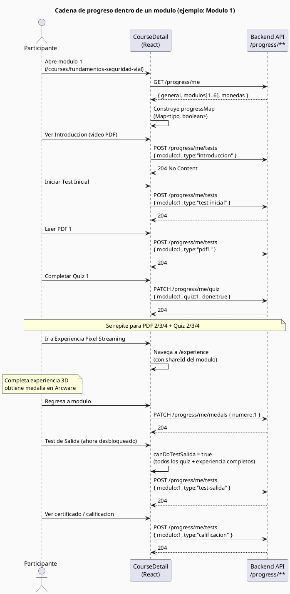
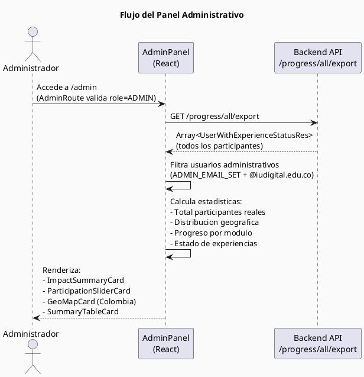

# Guia de Desarrollo — Plataforma de Formacion en Seguridad Vial

**Version:** 1.0  
**Fecha:** Marzo 2026  
**Audiencia:** Desarrolladores, arquitectos y DevOps del proyecto

---

## Indice

1. [Vision general del sistema](#1-vision-general-del-sistema)
2. [Arquitectura de la solucion](#2-arquitectura-de-la-solucion)
3. [Estructura del repositorio](#3-estructura-del-repositorio)
4. [Capa de base de datos](#4-capa-de-base-de-datos)
5. [Backend — Spring Boot WebFlux](#5-backend--spring-boot-webflux)
6. [Frontend — React + Vite](#6-frontend--react--vite)
7. [Infraestructura y contenedores](#7-infraestructura-y-contenedores)
8. [Flujos de negocio clave](#8-flujos-de-negocio-clave)
9. [Seguridad](#9-seguridad)
10. [Variables de entorno](#10-variables-de-entorno)
11. [Guia de despliegue](#11-guia-de-despliegue)
12. [Consideraciones y deuda tecnica](#12-consideraciones-y-deuda-tecnica)

---

## 1. Vision general del sistema

La plataforma es un programa de formacion en linea en **Seguridad Vial** diseñado para la Agencia Nacional de Seguridad Vial (ANSV) de Colombia. Permite a ciudadanos registrarse, avanzar a traves de seis modulos tematicos con contenido academico (PDFs, quizzes, videos), realizar un diagnostico de perfil de riesgo vial, participar en una experiencia inmersiva gamificada con tecnologia de Pixel Streaming (via Arcware Cloud), y consultar una asistente virtual llamada **NIA**, impulsada por Google Gemini.

La solucion esta compuesta por tres capas contenidas en Docker: base de datos MySQL, API REST reactiva en Spring Boot, y aplicacion SPA en React servida por Nginx.

---

## 2. Arquitectura de la solucion

### 2.1 Diagrama de contexto del sistema

```plantuml
@startuml C4_Context
!include https://raw.githubusercontent.com/plantuml-stdlib/C4-PlantUML/master/C4_Context.puml

title Diagrama de Contexto — Plataforma ANSV Seguridad Vial

Person(student, "Participante", "Ciudadano que toma el programa de formacion en seguridad vial")
Person(admin, "Administrador", "Funcionario ANSV/IU Digital que consulta las estadisticas del programa")

System(platform, "Plataforma de Formacion\nSeguridad Vial", "Aplicacion web que gestiona el acceso, el progreso academico y la experiencia gamificada del participante")

System_Ext(arcware, "Arcware Cloud\n(Pixel Streaming)", "Plataforma de streaming interactivo que aloja la experiencia 3D gamificada del programa")
System_Ext(gemini, "Google Gemini API", "Modelo de lenguaje usado por NIA, la asistente virtual de aprendizaje")
System_Ext(nivel99, "nivel99.com", "Backend externo de la experiencia gamificada que almacena el estado de las medallas del participante")

Rel(student, platform, "Accede, estudia y completa modulos", "HTTPS")
Rel(admin, platform, "Consulta estadisticas y exporta datos", "HTTPS")
Rel(platform, arcware, "Lanza experiencia de Pixel Streaming", "WebSocket / HTTPS")
Rel(platform, gemini, "Consulta IA para respuestas de NIA (frontend directo)", "HTTPS / REST")
Rel(platform, nivel99, "Lee y guarda estado de medallas del participante", "HTTPS / REST")
@enduml
```

### 2.2 Diagrama de contenedores

```plantuml
@startuml C4_Containers
!include https://raw.githubusercontent.com/plantuml-stdlib/C4-PlantUML/master/C4_Container.puml

title Diagrama de Contenedores — Plataforma ANSV

Person(user, "Usuario (Participante / Admin)")

System_Boundary(platform, "Plataforma de Formacion — Docker Compose Stack") {

    Container(frontend, "Frontend SPA", "React 18, Vite, TailwindCSS\nNginx (servidor)", "Interfaz de usuario. Sirve la SPA y actua como reverse proxy hacia el backend. Expuesto en :3000")

    Container(backend, "Backend API", "Spring Boot 3.5.3\nWebFlux / R2DBC\nJava 17", "API REST reactiva. Gestiona autenticacion, usuarios, progreso y proxy a servicios externos. Expuesto en :8080")

    ContainerDb(db, "Base de Datos", "MySQL 8.0", "Almacena usuarios, credenciales y progreso detallado por modulo. Expuesto en :3307 (host)")
}

System_Ext(arcware, "Arcware Cloud")
System_Ext(gemini, "Google Gemini API")
System_Ext(nivel99, "nivel99.com")

Rel(user, frontend, "Navega la aplicacion", "HTTPS :3000")
Rel(frontend, backend, "Proxying de API calls via Nginx", "HTTP interno :8080")
Rel(backend, db, "Lectura/escritura de datos (R2DBC)", "TCP :3306")
Rel(frontend, arcware, "Inicializa sesion Pixel Streaming", "WSS / HTTPS")
Rel(frontend, gemini, "Solicitudes de chat NIA (clave VITE_GEMINI_API_KEY)", "HTTPS")
Rel(backend, nivel99, "Consulta y actualiza medallas del participante", "HTTPS")
@enduml
```

### 2.3 Diagrama de componentes — Backend



### 2.4 Diagrama de componentes — Frontend



---

## 3. Estructura del repositorio

```
/
├── docker-compose.yaml          # Orquestacion de los tres servicios
├── db/
│   └── init.sql                 # DDL inicial de la base de datos
├── portalweb/                   # Frontend React + Nginx
│   ├── Dockerfile               # Multi-stage: Node build + Nginx serve
│   ├── nginx.conf               # Reverse proxy + SPA fallback
│   ├── vite.config.js
│   ├── tailwind.config.js
│   ├── public/                  # Activos estaticos (PDFs, imagenes, videos)
│   └── src/
│       ├── App.jsx              # Definicion del router
│       ├── context/             # AuthContext (estado global de sesion)
│       ├── pages/               # Vistas principales de la aplicacion
│       ├── components/          # Componentes reutilizables por dominio
│       ├── services/            # Clientes HTTP por dominio de negocio
│       ├── hooks/               # Hooks de logica de negocio
│       ├── layouts/             # DashboardLayout (nav lateral/inferior)
│       ├── routes/              # Guards de ruta
│       └── data/                # Datos estaticos (courseData, quizzes)
└── servicios/                   # Backend Spring Boot
    ├── Dockerfile
    ├── pom.xml
    ├── data/
    │   └── data.csv             # Roster opcional de participantes
    └── src/main/java/com/ui/main/
        ├── IuAuthApplication.java
        ├── controller/          # Controladores REST
        ├── services/            # Logica de negocio
        ├── repository/          # Repositorios R2DBC + entidades
        │   └── entity/
        ├── security/            # JWT filter chain
        ├── config/              # SecurityConfig, CORS, WebClient
        ├── exception/           # Manejo global de errores
        └── model/dto/           # DTOs de entrada y salida
```

---

## 4. Capa de base de datos

### 4.1 Modelo de datos



### 4.2 Descripcion de tablas

| Tabla | Proposito |
|---|---|
| `users` | Perfil completo del participante: datos demograficos, credenciales (BCrypt), rol (USER / ADMIN), resultado del diagnostico de riesgo vial y referencia al avatar seleccionado. |
| `module_progress` | Progreso granular por modulo y por participante. Una fila por combinacion (email, modulo). El modulo 0 reserva el test general. Los modulos 1-6 rastrean each actividad: video-intro, 4 PDFs, 4 quizzes, tests. |
| `user_progress` | Estado de las 6 medallas gamificadas obtenidas en la experiencia de Pixel Streaming. Una fila por participante. |

### 4.3 Notas de diseño

- La columna `email` se duplica como identificador de negocio en `module_progress` y `user_progress` para facilitar consultas sin JOIN en el contexto reactivo.
- El campo `modulo = 0` en `module_progress` actua como contenedor del progreso general (test diagnostico inicial, test final de programa y configuracion de avatar).
- Las contrasenas se almacenan exclusivamente como hash BCrypt. No existe mecanismo de recuperacion que exponga el hash.
- `role = 'ADMIN'` se asigna automaticamente en `AuthService.buildUserForSignup` cuando la contrasena de registro coincide con `ADMIN_MASTER_PASSWORD`. Este mecanismo debe reforzarse mediante un endpoint administrativo dedicado en un sprint posterior (ver [seccion 12](#12-consideraciones-y-deuda-tecnica)).

---

## 5. Backend — Spring Boot WebFlux

### 5.1 Stack tecnologico

| Componente | Tecnologia | Version |
|---|---|---|
| Framework | Spring Boot | 3.5.3 |
| Paradigma | Reactive (Project Reactor) | WebFlux |
| Persistencia | Spring Data R2DBC + r2dbc-mysql | 0.9.6 |
| Seguridad | Spring Security (WebFlux stateless) | - |
| Tokens | JJWT | 0.11.5 |
| Hash de contrasena | BCryptPasswordEncoder | - |
| IA | Google GenAI SDK | 1.0.0 |
| Cliente HTTP reactivo | Spring WebClient | - |
| JDK | Java | 17 |
| Build | Maven | - |

### 5.2 API REST — Endpoints

#### /auth — Publico (sin autenticacion)

| Metodo | Path | Descripcion | Body |
|---|---|---|---|
| `POST` | `/auth/verify-identity` | Valida formato de email y cedula | `{ email, dni }` |
| `POST` | `/auth/signup` | Registra un nuevo usuario | `SignupReq` |
| `POST` | `/auth/login` | Autentica y emite JWT | `{ email, password }` → `{ token }` |
| `POST` | `/auth/reset-password` | Restablece contrasena verificando email+cedula | `{ email, dni, newPassword }` |

#### /users — Autenticado

| Metodo | Path | Descripcion |
|---|---|---|
| `GET` | `/users/me` | Devuelve perfil completo del usuario autenticado |
| `PUT` | `/users/me` | Actualiza campos del perfil (name, phone, avatarId, riskProfile, etc.) |

#### /progress — Autenticado

| Metodo | Path | Descripcion | Body |
|---|---|---|---|
| `GET` | `/progress/me` | Estado completo de progreso (general + 6 modulos + 6 medallas) | - |
| `POST` | `/progress/me/tests` | Marca una actividad como completada | `{ modulo, type }` |
| `PATCH` | `/progress/me/quiz` | Marca / desmarca un quiz especifico | `{ modulo, quiz, done }` |
| `PATCH` | `/progress/me/medals` | Registra una medalla ganada en Pixel Streaming | `{ numero }` |
| `POST` | `/progress/me/avatar` | Marca que el usuario configuro su avatar | - |
| `GET` | `/progress/all` | Lista paginada de usuarios con estado de experiencia (ADMIN) | `?page=&size=` |
| `GET` | `/progress/all/export` | Lista completa sin paginacion para exportacion (ADMIN) | - |

**Valores de `type` en `/progress/me/tests`:**
`test-inicial`, `test-salida`, `calificacion`, `introduccion`, `pdf1`, `pdf2`, `pdf3`, `pdf4`, `avatar`

#### /gemini — Autenticado

| Metodo | Path | Descripcion |
|---|---|---|
| `POST` | `/gemini` | Genera una respuesta de texto usando Gemini 2.0 Flash | `{ message }` |

### 5.3 Modelo de seguridad JWT



**Claims del JWT:**
- `sub`: email del usuario
- `uid`: ID interno en base de datos
- `role`: `USER` o `ADMIN`
- `avatarId`: identificador del avatar seleccionado
- `iat` / `exp`: timestamps estandar

### 5.4 Modelo reactivo

El backend es completamente no-bloqueante. Cada operacion retorna un `Mono<T>` o `Flux<T>`. El acceso a base de datos usa **R2DBC**, eliminando threads bloqueados por I/O de DB. La excepcion son las llamadas al SDK de Google GenAI (bloqueante), que se ejecutan en `Schedulers.boundedElastic()` para no contaminar el event loop de Reactor.

### 5.5 Integracion externa — nivel99.com

`ExternalProgressService` usa un `WebClient` configurado en `ExternalProgressConfig` para comunicarse con `nivel99.com`. Expone tres operaciones reactivas:

- `readByDni(dni)`: consulta el estado de medallas de un participante por cedula.
- `readAll()`: obtiene el estado de todos los usuarios registrados en la plataforma externa.
- `upsertMedals(idEstudiante, m1..m4)`: actualiza medallas via `POST` multipart.

Esta integracion es tolerante a fallos: errores 4xx/5xx retornan un `MonedaDto.none()` en lugar de propagar la excepcion, garantizando que fallos en el sistema externo no interrumpan el flujo principal.

---

## 6. Frontend — React + Vite

### 6.1 Stack tecnologico

| Componente | Tecnologia |
|---|---|
| Framework | React 18 |
| Build tool | Vite |
| Estilos | TailwindCSS |
| Routing | React Router v6 (Data API) |
| Cliente HTTP | Fetch API (wrapper propio en `http.js`) |
| Animaciones | Framer Motion |
| PDF viewer | `@react-pdf-viewer/core` |
| Pixel Streaming | `@arcware-cloud/pixelstreaming-websdk` |
| Markdown | `react-markdown` + `remark-gfm` |
| AI (NIA) | `@google/generative-ai` (directo desde navegador) |

### 6.2 Estructura de rutas



### 6.3 Gestion de estado de sesion (AuthContext)

`AuthContext` es el unico punto de verdad para la sesion del usuario. Persiste el token en `localStorage` bajo la clave `"session"`. Al iniciar la aplicacion, hidrta la sesion llamando a `/users/me` con el token guardado para verificar validez. Si el backend responde 401, fuerza logout y redirige a `/login`.

El contexto programa un `setTimeout` que expira exactamente cuando el JWT vence (`exp - 500ms`), ejecutando un `hardLogout()` proactivo sin necesidad de esperar un fallo de API.

Los componentes consumen el contexto via `useAuth()`.

### 6.4 Capa de servicios HTTP

`http.js` es un wrapper ligero sobre Fetch que:

- Prependa `VITE_API_URL` a cada llamada (vacio en produccion, pues Nginx proxea desde la misma origen).
- Inyecta el header `Authorization: Bearer <token>` automaticamente desde `session.js`.
- Implementa timeout de 15 segundos via `AbortController`.
- Emite el evento global `app:unauthorized` cuando recibe un 401, lo que activa el logout desde `AuthContext` sin acoplamiento directo.
- Deserializa el cuerpo como JSON o retorna `null` si esta vacio.

### 6.5 Flujo de progreso de modulo

Cada modulo sigue una cadena de prerequisitos estricta:

```
Introduccion → Test Inicial → [PDF1+Quiz1, PDF2+Quiz2, PDF3+Quiz3, PDF4+Quiz4] + Experiencia Pixel Streaming → Test de Salida → Certificado
```

El componente `CourseDetail` mantiene un `Map<string, boolean>` (`progressMap`) que refleja en tiempo real el estado de cada actividad. Los botones de actividades bloqueadas renderizan un tooltip explicativo via `LockedTooltip`. Los 4 quizzes se gestionan con `ResourceQuizModal`, que consulta las preguntas de `data/moduleQuizzes.js` y reporta el resultado a `/progress/me/quiz`.

### 6.6 Experiencia Pixel Streaming (Experience.jsx)

La pagina `Experience` integra el SDK de Arcware Cloud para iniciar una sesion de Pixel Streaming. Al conectar el stream, emite via `emitUIInteraction` la cedula (`studentId`) y el identificador del avatar (`avatarId`) del participante autenticado. La experiencia 3D usa estos datos para personalizar el avatar del usuario en el mundo virtual y reportar las medallas obtenidas de regreso al backend via `/progress/me/medals`.

### 6.7 Asistente virtual NIA

NIA opera con dos integraciones paralelas:

| Canal | Implementacion | Caso de uso |
|---|---|---|
| **Frontend directo** | `@google/generative-ai` con `VITE_GEMINI_API_KEY` | Chat principal en `/chat`. Usa `gemini-2.5-flash-lite` con soporte de historial de conversacion y streaming. Historial persistido en `localStorage`. |
| **Backend proxy** | `GeminiService` con `GOOGLE_API_KEY` | Endpoint `/gemini` disponible para llamadas server-side. Usa `gemini-2.0-flash`. |

El `SYSTEM_PROMPT` de NIA la posiciona como guia de aprendizaje especializada en el programa ANSV, con alcance acotado a contenidos del curso y normativa vial colombiana.

### 6.8 Diagnostico de perfil de riesgo

`RiskProfileTest` implementa un algoritmo de puntuacion que combina: rango de edad, tipo de actor vial, frecuencia de desplazamiento, horario, experiencia y uso de proteccion. La puntuacion clasifica al participante en tres perfiles:

| Rango | Perfil |
|---|---|
| 0 – 3 | BAJO |
| 4 – 6 | MEDIO |
| >= 7 | ALTO |

El resultado se persiste en el perfil del usuario (`riskScore`, `riskProfile`, `actorVial`) y condiciona recomendaciones dentro de la plataforma.

---

## 7. Infraestructura y contenedores

### 7.1 Docker Compose

```plantuml
@startuml Docker_Compose
skinparam backgroundColor #FAFAFA
title Servicios Docker Compose

node "Docker Network: app-net" {
    database "mysql\n:3306 (interno)\n:3307 (host)" as MYSQL
    rectangle "backend\n:8080" as BE
    rectangle "frontend\n:80 (interno)\n:3000 (host)" as FE
}

volume "mysql_data" as VOL
file "db/init.sql" as SQL
file "servicios/data/data.csv" as CSV

MYSQL --> VOL : datos persistidos
SQL --> MYSQL : montado en /docker-entrypoint-initdb.d/
CSV --> BE : montado en /app/data/ (read-only)

BE --> MYSQL : depende_de (healthcheck OK)
FE --> BE : depende_de (service_started)

note right of FE : Build-time args:\n VITE_GEMINI_API_KEY\n VITE_API_URL\nrun-time: Nginx proxea\n/auth/, /users/,\n/progress/, /gemini/
note right of BE : Env: DB_HOST, DB_PORT,\nDB_NAME, DB_USER, DB_PASSWORD,\nJWT_SECRET, APP_ROSTER_CSV_PATH
@enduml
```

### 7.2 Build del frontend (multi-stage)

El `Dockerfile` de `portalweb` sigue un patron multi-stage:

1. **Stage `builder` (node:18):** instala dependencias y ejecuta `npm run build`, produciendo el directorio `dist` (Vite).
2. **Stage final (nginx:stable-alpine):** copia el artefacto `build/` al root de Nginx y aplica `nginx.conf`.

Las variables de entorno `VITE_*` se inyectan como `ARG` en el Dockerfile y se materializan en el bundle en tiempo de build por Vite.

### 7.3 Nginx como reverse proxy

Nginx sirve simultaneamente como servidor de la SPA y como reverse proxy hacia el backend:

| Patron de ruta | Destino |
|---|---|
| `/auth/*` | `http://backend:8080/auth/` |
| `/users/*` | `http://backend:8080/users/` |
| `/progress/*` | `http://backend:8080/progress/` |
| `/gemini/*` | `http://backend:8080/gemini/` |
| `/static/*` | Cache agresivo (1 ano, immutable) |
| Cualquier otra | `index.html` (SPA fallback) |

Todas las rutas de proxy propagan el header `Authorization` al backend, soportan WebSocket (`Upgrade`, `Connection`) y tienen un timeout de lectura de 60 segundos.

---

## 8. Flujos de negocio clave

### 8.1 Registro de nuevo participante



### 8.2 Autenticacion y carga de sesion



### 8.3 Progreso dentro de un modulo



### 8.4 Panel administrativo



---

## 9. Seguridad

### 9.1 Autenticacion y autorizacion

- Todos los endpoints estan protegidos excepto `/auth/**` y rutas `OPTIONS` (preflight CORS).
- El JWT se firma con HS256 usando un secreto de 64 bytes codificado en Base64 (configurable via `JWT_SECRET`). Duracion de 120 minutos.
- El Frontend ejecuta logout proactivo antes de que el token expire, evitando errores en vuelo.
- No existe refresh token en la iteracion actual. La sesion se renueva unicamente con un nuevo login (ver [seccion 12](#12-consideraciones-y-deuda-tecnica)).

### 9.2 Almacenamiento de credenciales

- Las contrasenas se almacenan como hash BCrypt (strength default = 10 rounds).
- El JWT_SECRET debe rotar periodicamente y no debe comprometerse en el repositorio. En produccion debe inyectarse via ambiente del orquestador (Kubernetes Secret, AWS Secrets Manager, etc.).

### 9.3 CORS

`WebCorsConfig` gestiona los origenes permitidos. En el entorno Docker, el cliente legitimo es siempre la propia origen del frontend (mismo host/puerto). CORS debe restringirse a origenes especificos en produccion, no usar wildcard `*`.

### 9.4 Inyeccion y validacion de entradas

- Los DTOs de entrada usan anotaciones Jakarta Validation (`@Valid`, `@NotBlank`, `@Email`, etc.).
- `AuthService` aplica val idacion adicional con expresiones regulares propias para email y cedula.
- Las consultas a base de datos usan repositorios R2DBC parametrizados; no existe construccion dinamica de SQL.

### 9.5 Mecanismo de escalado de privilegios (deuda tecnica critica)

El rol `ADMIN` se asigna hoy cuando la contrasena de registro coincide con la constante `ADMIN_MASTER_PASSWORD` definida en `AuthService`. Esta es una implementacion provisional que **debe reemplazarse** por un endpoint administrativo protegido o un script de seed antes de pasar a un entorno de produccion de escala.

---

## 10. Variables de entorno

### Backend (`servicios`)

| Variable | Descripcion | Valor default |
|---|---|---|
| `DB_HOST` | Host del servidor MySQL | `localhost` |
| `DB_PORT` | Puerto MySQL | `3306` |
| `DB_NAME` | Nombre de la base de datos | `iu_auth` |
| `DB_USER` | Usuario MySQL | `root` |
| `DB_PASSWORD` | Contrasena MySQL | `root` |
| `JWT_SECRET` | Secreto HS256 (Base64, min 32 bytes) | valor de desarrollo hardcodeado |
| `APP_ROSTER_CSV_PATH` | Ruta al archivo CSV con roster | `/app/data/data.csv` |
| `GOOGLE_API_KEY` | API Key de Google Gemini (backend) | `afervsdre43234` (invalido) |

### Frontend (`portalweb`) — Build-time

| Variable | Descripcion |
|---|---|
| `VITE_API_URL` | URL base del backend (vacio en produccion — Nginx proxea) |
| `VITE_GEMINI_API_KEY` | API Key de Google Gemini para el chat NIA en el navegador |

---

## 11. Guia de despliegue

### Requisitos previos

- Docker Engine >= 24
- Docker Compose >= 2.20
- Las API Keys de Google Gemini deben estar disponibles

### Pasos de despliegue local / staging

```bash
# 1. Clonar el repositorio
git clone <url-repositorio>
cd iu

# 2. Crear archivo de variables de entorno (NO commitear al repositorio)
cat > .env << 'EOF'
VITE_GEMINI_API_KEY=tu_api_key_gemini_frontend
VITE_API_URL=
GOOGLE_API_KEY=tu_api_key_gemini_backend
JWT_SECRET=genera_un_secreto_de_64_bytes_seguro
DB_PASSWORD=una_contrasena_segura
EOF

# 3. Construir e iniciar los servicios
docker compose up --build -d

# 4. Verificar estado de los servicios
docker compose ps

# 5. Ver logs del backend
docker compose logs -f backend

# 6. Verificar salud de la base de datos
docker compose exec mysql mysqladmin ping -h localhost -uroot -proot
```

### Verificacion del despliegue

```bash
# Health check del backend
curl http://localhost:3000/actuator/health

# Verificacion de autenticacion
curl -X POST http://localhost:3000/auth/login \
  -H "Content-Type: application/json" \
  -d '{"email":"test@test.com","password":"password123"}'
```

### Consideraciones de produccion

1. **Base de datos:** Usar una instancia MySQL gestionada (RDS, Cloud SQL) en lugar del contenedor. Configurar replicas de lectura si se proyecta alta carga.
2. **Secretos:** JWT_SECRET y DB_PASSWORD deben provenir de un gestor de secretos. No deben estar en el repositorio ni en el `.env` commiteado.
3. **TLS:** Implementar terminacion TLS en un load balancer externo (ALB, Cloudflare) frente a Nginx.
4. **Variables Gemini:** `VITE_GEMINI_API_KEY` es visible en el bundle del navegador. Considerar mover todo el trafico de NIA al proxy del backend con rate limiting por usuario.
5. **Escalado del backend:** Spring WebFlux soporta escalar horizontalmente sin estado de sesion (stateless JWT). El unico estado compartido es la base de datos.

---

## 12. Consideraciones y deuda tecnica

| Item | Severidad | Descripcion |
|---|---|---|
| ADMIN_MASTER_PASSWORD | Critica | El rol ADMIN se eleva por contrasena hardcodeada en codigo fuente. Debe reemplazarse por seed script o endpoint administrativo con autorizacion propia antes de produccion. |
| Refresh token | Media | La sesion expira a los 120 minutos sin posibilidad de renovacion silenciosa. Implementar un endpoint `/auth/refresh` con un token de larga duracion almacenado en cookie `HttpOnly`. |
| VITE_GEMINI_API_KEY en navegador | Media | La API key de Google Gemini es visible en el bundle JS del cliente. Considerar proxy en backend con rate limiting por JWT para evitar abuso. |
| CORS wildcard en desarrollo | Media | `WebCorsConfig` debe configurarse con origenes explicitos en produccion. |
| Doble integracion Gemini | Baja | Existen dos rutas para llamar a Gemini (frontend directo y backend proxy). Unificar en el backend aporta mejor control de costos y auditoria. |
| Sin test de integracion | Baja | El directorio `test/java` no contiene pruebas. Implementar pruebas de contrato para los endpoints criticos (`/auth/**`, `/progress/**`). |
| Roster CSV sin uso activo | Baja | El `data.csv` esta montado y `RosterProperties` esta configurado, pero la verificacion de identidad ya no consulta el roster (se simplificó a validacion de formato). El mecanismo puede eliminarse o reactivarse segun decision de negocio. |
| Logs sin correlacion | Baja | No existe un MDC/trace ID que correlacione logs entre frontend y backend. Implementar `X-Request-ID` para facilitar el debugging en produccion. |
